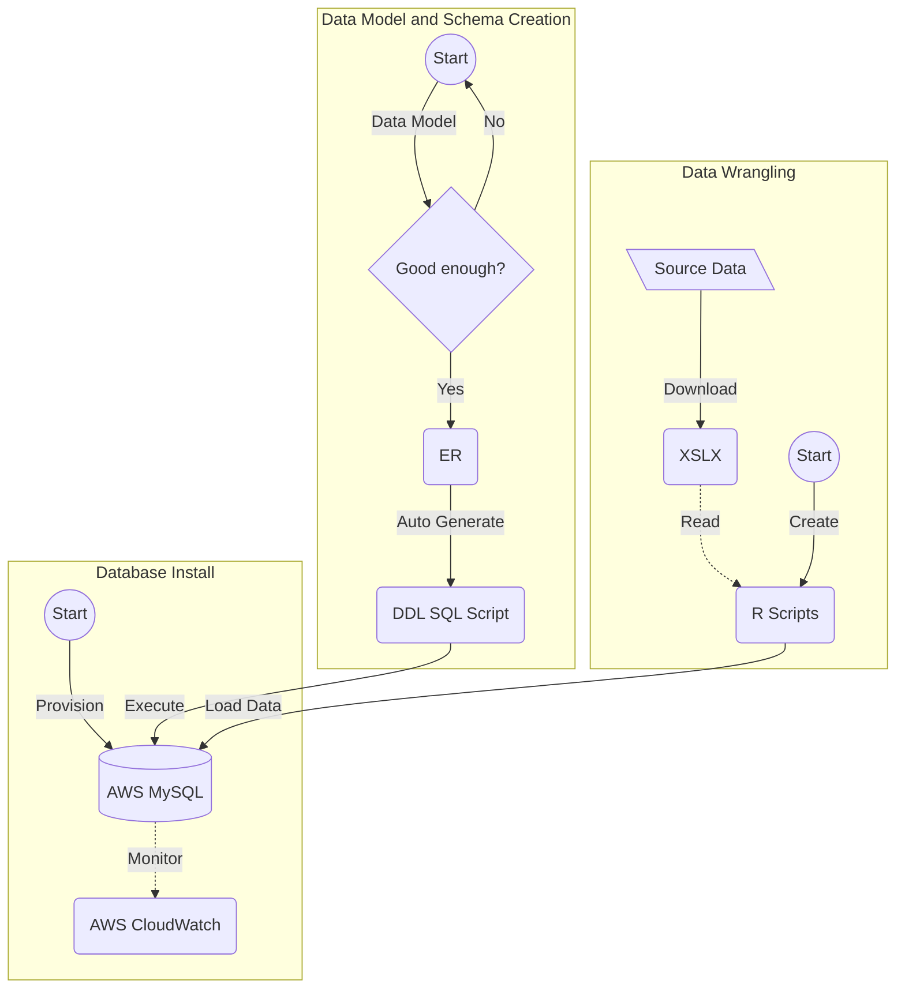

# Presentation

## TODO
- [ ] Data  - Melissa
- [ ] Data Wrangling - Josh
- [ ] Database Design and Data Loading - Jawaid
- [ ] Data Model - Jawaid
- [ ] EDAs - Josh and Christian

***

# Project Overview

See [Intro](https://github.com/himalayahall/DATA607-PROJECT3/blob/main/Intro.md) for team introduction and project overview. 

***

# Data Source

The objective of this project was to answer the following: Which are the most valued data science skills? To answer this question, it was determined to use an existing data set from Jeff Hale article The Most In-Demand Skills for Data Scientists (https://towardsdatascience.com/the-most-in-demand-skills-for-data-scientists-4a4a8db896db). This data was available for download as a multi-sheet excel file (https://docs.google.com/spreadsheets/d/1lac1H2IgCDCs9LLTQL6yb6MUPN1u4C5fJv_6YjipIaM/edit#gid=469548382).
Data was extracted from multiple Excel sheets, tidied using R, and output CSVs were generated for populating the core data model entities. The output CSVs were uploaded into an AWS MySQL database for shared storage and access. The database was then accessed through R and multiple EDAs were generated for further analysis and investigation. 
The team discussed refreshing the source dataset to make it more current, but the vendor APIs required paid subscriptions. In addition, we did not have sufficient time to explore no-fee alternatives.


***

## Data Wrangling 

See full code and output [here](https://github.com/himalayahall/DATA607-PROJECT3/blob/main/DATA607_Project3_Wrangling.pdf)

<details>
           <summary>R code (Click Me)</summary>

I. Using packages:

```
library(tidyverse)
library(readxl)
library(stringr)
library(lubridate)
```

1. Loading data locally:

```
# read file locally 
file <- "/Users/joshiden/Documents/Classes/CUNY SPS/Fall 2022/DATA 607/Projects/Project 3/Data Science Career Terms.xlsx"
excel <- read_excel(file)

# store sheet names
sheets <- excel_sheets(file)

# read sheets into dataframes
ds_skills <- read_excel(file, sheet = sheets[1])
ds_software <- read_excel(file, sheet = sheets[2])
education <- read_excel(file, sheet=sheets[7])
```

2. Tidying data by keyword category for table creation:

```
# Find row index of Total
totalIdx <- which(ds_skills$Keyword == "Total")
skills <- ds_skills |> 
           # Grab beginning rows until and excluding Total entry
           slice_head(n = totalIdx - 1) |>
           # select Keyword column
           select(Keyword) |>
           # drop NA
           filter(! is.na(Keyword)) |>
           # uppercase
           mutate(Keyword = str_to_upper(Keyword)) |>
           # add T_GENERAL and T_SOFT categories
           mutate(Category=ifelse(Keyword == "COMMUNICATION", "T_SOFT", 
                    ifelse(Keyword == "PROJECT MANAGEMENT", "T_SOFT", "T_GENERAL")))
                    
totalIdx <- which(ds_software$Keyword == "Total")
software <- ds_software |> 
           # Grab beginning rows until and excluding Total entry
           slice_head(n = totalIdx - 1) |> 
           # select Keyword column
           select(Keyword) |>
           # drop NA
           filter(! is.na(Keyword)) |>
           # uppercase
           mutate(Keyword = str_to_upper(Keyword)) |>
           # add T_SOFTWARE category
           mutate(Category = "T_SOFTWARE")
```

3. Transforming the data for table population:

```
# dataframe: ds_skills_transformed 
# keep only first 15 rows
# Keyword to upper
# pivot columns to column: source
ds_skills_transformed <- ds_skills |>
  head(15) |>
  mutate(Keyword = toupper(Keyword)) |>
  rename(KEYWORD = Keyword) |>
  pivot_longer(cols=("LinkedIn":"Monster"), names_to="SOURCE", values_to="COUNT") |>
  mutate(SOURCE = toupper(SOURCE), SURVEY_DATE=ymd("2018-06-15")) |>
  arrange(KEYWORD,SOURCE)
ds_skills_transformed

# dataframe: ds_software_transformed
# keep top 37 rows
# keyword to upper
# pivot columns to source
# source column to upper
# add date column
ds_software_transformed <- ds_software |>
  select(c("Keyword":"Monster")) |>
  head(37) |>
  mutate(Keyword = toupper(Keyword)) |>
  rename(KEYWORD = Keyword) |>
  pivot_longer(cols=("LinkedIn":"Monster"), names_to="SOURCE", values_to="COUNT") |>
  mutate(SOURCE = toupper(SOURCE), SURVEY_DATE=ymd("2018-06-15")) |>
  arrange(KEYWORD,SOURCE)
ds_software_transformed

# dataframe: education_transformed
# keyword to uppercase
# pivot columns to source
# source column to uppercase
# add date column
# drop AngelList column
# drop NA values
education_transformed <- education |>
  mutate(Keyword = toupper(Keyword)) |>
  rename(KEYWORD = Keyword) |>
  pivot_longer(cols=("LinkedIn":"SimplyHired"), names_to="SOURCE", values_to="COUNT") |>
  mutate(SOURCE = toupper(SOURCE), SURVEY_DATE=ymd("2018-06-15")) |>
  subset(select = -c(AngelList)) |>
  drop_na() |>
  arrange(KEYWORD,SOURCE)
education_transformed

# dataframe: skills_in_demand
skills_in_demand <- rbind(ds_skills_transformed,ds_software_transformed)
skills_in_demand
```

The files were then written to CSV and committed to project GitHub repository. 

</details>
***

## Database Design and Data Loading 

1. Cloud database - shared infra, security, configuration, and mintoring
```
AWS MySQL
```


2. Design Driven Development - start with normalized [ER Diagram](#data-model) using databse IDE
```
MySQLWorkbench
ER Designer
```
3. Code generation
```
DDL SQL
```
4. Forward engineer database schema from DDL
5. Data import wizard

***

# Database Design Process



</details>

## Data Model
The ER modeling was executed by MySQL Workbench. After creating normalized data model entities, the auto-generate SQL scripts for database schema was created, which made it easy to forward engineer schema on both AWS and local MySQL. Schema includes foreign key relationships and referential integrity checks/actions (e.g. cascade delete). As mentioned above, entities include timestamps for tracking survey date and record level create/update actions.

<details><summary>ER Diagram (Click Me)</summary>


           </details>
           
<details><summary>Database Entities (Click Me)</summary>

1. SOURCE  
    Sources of demand data (Linkedin, Monster, etc.)
    
2. SKILL  
    - Skill (R, NLP, Communication, etc.)
    - Category - in the source dataset skills are grouped 2 tabs: **DS skills**, and **DS software**. Within *DS software* are **technical** skills (machine learning, statistics, etc.) and **soft** skills (communication and project management). Since these sub-catrgories are not identified explicitly in the source dataset, manual tagging was necessary. The final category buckets are **T_SOFTWARE**, **T_GENERAL**, and **SOFT**. The *T* prefeix designates *technical* skills, which includes both  *software* and *general*. The prefix also makes it straightforward to filter technical and soft Data Science skills. 
    
3. EDUCATION  
    Education levels (BS, MS, etc.)
    
4. SKILL_IN_DEMAND  
    Skill demand (Source, skill, demand, etc.)
    
5. EDUCATION_IN_DEMAND  
    Education demand (Source, education, demand, etc.)
</details>

***

# Exploratory Data Analysis 
(describe EDAs)

***
