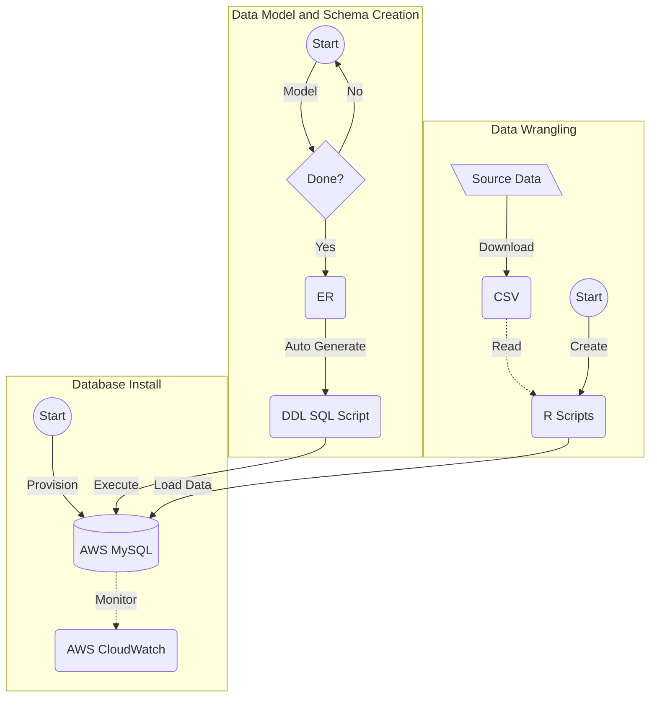

# Presentation

## TODO
- [ ] Data - Josh
- [ ] Data Model - Jawaid
- [ ] Data Wrangling - Melissa
- [ ] Database - Jawaid
- [ ] EDAs - Josh and Christian

# Project Overview

See [Intro](https://github.com/himalayahall/DATA607-PROJECT3/blob/main/Intro.md) for team introduction and project overview. 

# Data

## Data Model

Entities (Click Me)

1. SOURCE  
    Sources of demand data (Linkedin, Monster, etc.)
    
3. SKILL  
    Skills (R, NLP, Communication, etc.) and categories. Skill categories are T_SOFTWARE, T_GENERAL, and SOFT. The *T_* prefeix designates *technical* skills - *software* and *general*. The prefix also makes it straightforward to filter technical skills from *soft* skills. 
    
5. EDUCATION  
    Education levels (BS, MS, etc.)
    
7. SKILL_IN_DEMAND  
    Skill demand (Source, skill, demand, etc.)
    
9. EDUCATION_IN_DEMAND  
    Education demand (Source, education, demand, etc.)

## Data Wrangling

## Database Design and Data Loading

# Exploratory Data Analysis
