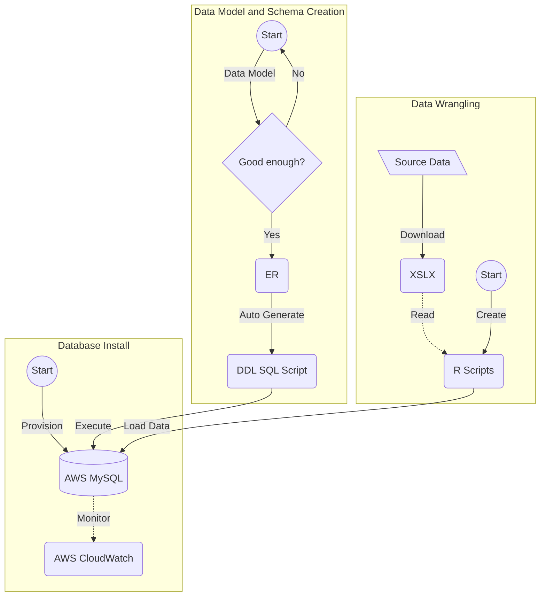

# Presentation

## TODO
- [ ] Data  - Melissa
- [ ] Data Wrangling - Josh
- [ ] Database Design and Data Loading - Jawaid
- [ ] Data Model - Jawaid
- [ ] EDAs - Josh and Christian

# Project Overview

See [Intro](https://github.com/himalayahall/DATA607-PROJECT3/blob/main/Intro.md) for team introduction and project overview. 

# Data Source
(describe data source)

## Data Wrangling 
(describe data wrangling strategy - R scripts, manual population of smaller tables, etc.)

## Database Design and Data Loading 
(describe database design approach and data loading)

## Data Model
(describe data model)

Entities (Click Me)

1. SOURCE  
    Sources of demand data (Linkedin, Monster, etc.)
    
3. SKILL  
    - Skill (R, NLP, Communication, etc.)
    - Category - in the source dataset skills are grouped 2 tabs: **DS skills**, and **DS software**. Within *DS software* are **technical** skills (machine learning, statistics, etc.) and **soft** skills (communication and project management). Since these sub-catrgories are not identified explicitly in the source dataset, manual tagging was necessary. The final category buckets are **T_SOFTWARE**, **T_GENERAL**, and **SOFT**. The *T* prefeix designates *technical* skills, which includes both  *software* and *general*. Adding the prefix also makes it straightforward to filter technical and soft Data Science skills. 
    
5. EDUCATION  
    Education levels (BS, MS, etc.)
    
7. SKILL_IN_DEMAND  
    Skill demand (Source, skill, demand, etc.)
    
9. EDUCATION_IN_DEMAND  
    Education demand (Source, education, demand, etc.)

# Exploratory Data Analysis 
(describe EDAs)
