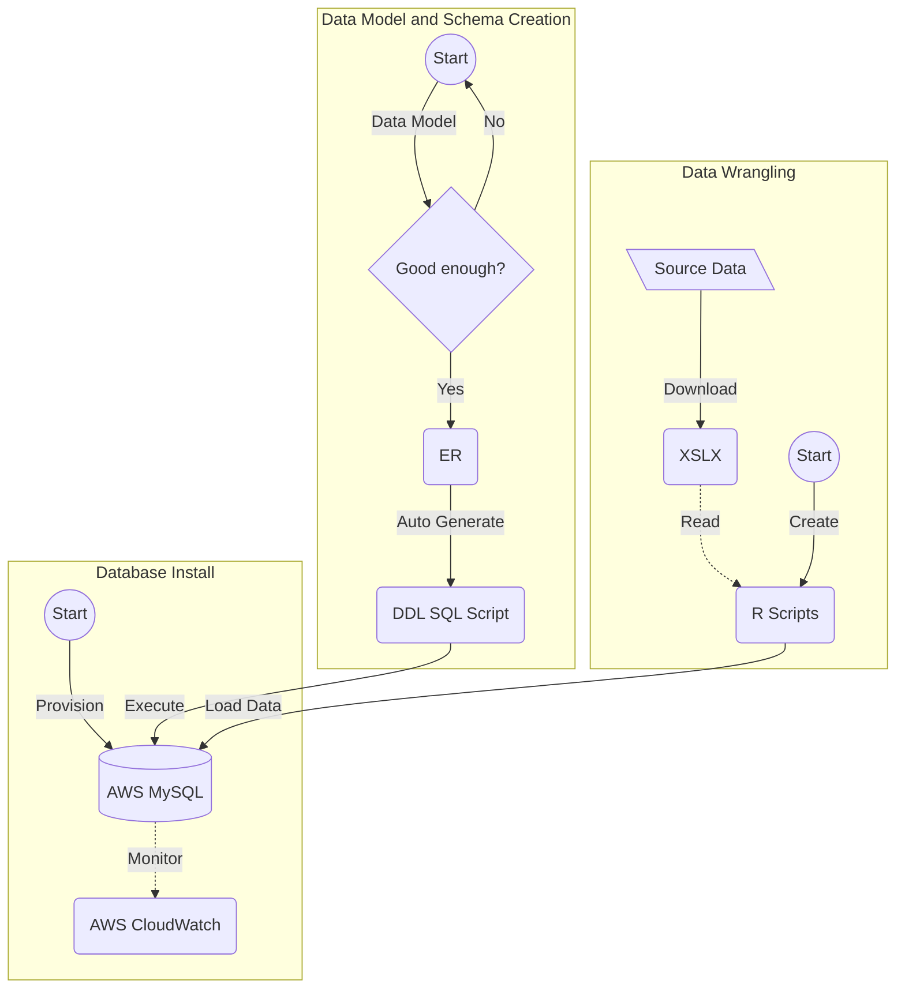

# Presentation

## TODO
- [ ] Data  - Melissa
- [ ] Data Wrangling - Josh
- [ ] Database Design and Data Loading - Jawaid
- [ ] Data Model - Jawaid
- [ ] EDAs - Josh and Christian

***

# Project Overview

See [Intro](https://github.com/himalayahall/DATA607-PROJECT3/blob/main/Intro.md) for team introduction and project overview.

We  decided to use Github Markdown as the presentation format rather than more traditional presentation tools like Powerpoint. This is a nod to our developer ethos along with the preference to leverage as much open-source software and free tooling as possible. We have tried our best to maintain a balance between slick presentation and *no fluff just stuff*.

***

# Data Source

1. **Objective** - to answer the following question: which are the most valued data science skills? 
2. **Data Source** 
   - Use existing data set from Jeff Hale article [The Most In-Demand Skills for Data Scientists](https://towardsdatascience.com/the-most-in-demand-skills-for-data-scientists-4a4a8db896db)
   - Data was available for download as a multi-sheet [MS Excel](https://docs.google.com/spreadsheets/d/1lac1H2IgCDCs9LLTQL6yb6MUPN1u4C5fJv_6YjipIaM/edit#gid=469548382)
   - Team discussed refreshing the source dataset to make it more current. Unfortunately, vendor APIs require paid subscriptions. In addition, we did not have sufficient time to explore no-fee alternatives

The data source used was a convenient alternative to web scraping job site’s APIs which were inaccessible to use in the say way the dataset was generated from the article. It’s important to note that using hard data from the job site directly would have been the most ideal way to determine the most relevant data science skills over the qualitative data from the article. The reason being that quantitative data gives a real-world source of information and gives us a repeatable metric which then can be compared to the qualitative data.

***

## Data Wrangling 

See full code and output [here](https://github.com/himalayahall/DATA607-PROJECT3/blob/main/source/Wrangling.pdf)
<details>
   <summary>I. Using packages:</summary>
  
```
library(tidyverse)
library(readxl)
library(stringr)
library(lubridate)
```
   </details>
   <details>
   <summary>1. Loading data locally:</summary>
 
```
# read file locally 
file <- "/Users/joshiden/Documents/Classes/CUNY SPS/Fall 2022/DATA 607/Projects/Project 3/Data Science Career Terms.xlsx"
excel <- read_excel(file)

# store sheet names
sheets <- excel_sheets(file)

# read sheets into dataframes
ds_skills <- read_excel(file, sheet = sheets[1])
ds_software <- read_excel(file, sheet = sheets[2])
education <- read_excel(file, sheet=sheets[7])
```
   </details>
   <details>
   <summary>2. Tidying data by keyword category for table creation:
</summary>

```
# Find row index of Total
totalIdx <- which(ds_skills$Keyword == "Total")
skills <- ds_skills |> 
           # Grab beginning rows until and excluding Total entry
           slice_head(n = totalIdx - 1) |>
           # select Keyword column
           select(Keyword) |>
           # drop NA
           filter(! is.na(Keyword)) |>
           # uppercase
           mutate(Keyword = str_to_upper(Keyword)) |>
           # add T_GENERAL and T_SOFT categories
           mutate(Category=ifelse(Keyword == "COMMUNICATION", "T_SOFT", 
                    ifelse(Keyword == "PROJECT MANAGEMENT", "T_SOFT", "T_GENERAL")))
                    
totalIdx <- which(ds_software$Keyword == "Total")
software <- ds_software |> 
           # Grab beginning rows until and excluding Total entry
           slice_head(n = totalIdx - 1) |> 
           # select Keyword column
           select(Keyword) |>
           # drop NA
           filter(! is.na(Keyword)) |>
           # uppercase
           mutate(Keyword = str_to_upper(Keyword)) |>
           # add T_SOFTWARE category
           mutate(Category = "T_SOFTWARE")
```
   </details>
   <details>
   <summary>3. Transforming the data for table population:</summary>

```
# dataframe: ds_skills_transformed 
# keep only first 15 rows
# Keyword to upper
# pivot columns to column: source
ds_skills_transformed <- ds_skills |>
  head(15) |>
  mutate(Keyword = toupper(Keyword)) |>
  rename(KEYWORD = Keyword) |>
  pivot_longer(cols=("LinkedIn":"Monster"), names_to="SOURCE", values_to="COUNT") |>
  mutate(SOURCE = toupper(SOURCE), SURVEY_DATE=ymd("2018-06-15")) |>
  arrange(KEYWORD,SOURCE)
ds_skills_transformed

# dataframe: ds_software_transformed
# keep top 37 rows
# keyword to upper
# pivot columns to source
# source column to upper
# add date column
ds_software_transformed <- ds_software |>
  select(c("Keyword":"Monster")) |>
  head(37) |>
  mutate(Keyword = toupper(Keyword)) |>
  rename(KEYWORD = Keyword) |>
  pivot_longer(cols=("LinkedIn":"Monster"), names_to="SOURCE", values_to="COUNT") |>
  mutate(SOURCE = toupper(SOURCE), SURVEY_DATE=ymd("2018-06-15")) |>
  arrange(KEYWORD,SOURCE)
ds_software_transformed

# dataframe: education_transformed
# keyword to uppercase
# pivot columns to source
# source column to uppercase
# add date column
# drop AngelList column
# drop NA values
education_transformed <- education |>
  mutate(Keyword = toupper(Keyword)) |>
  rename(KEYWORD = Keyword) |>
  pivot_longer(cols=("LinkedIn":"SimplyHired"), names_to="SOURCE", values_to="COUNT") |>
  mutate(SOURCE = toupper(SOURCE), SURVEY_DATE=ymd("2018-06-15")) |>
  subset(select = -c(AngelList)) |>
  drop_na() |>
  arrange(KEYWORD,SOURCE)
education_transformed

# dataframe: skills_in_demand
skills_in_demand <- rbind(ds_skills_transformed,ds_software_transformed)
skills_in_demand
```
</details> 

The files were then written to CSV and committed to project GitHub repository. 

           
***

## Database Design and Data Loading 

1. **Cloud database selection** - shared infra, configuration, monitoring, security, etc.          
<details><summary>AWS MySQL (Click me)</summary>
           

           
</details>
           
2. **Design Driven Development** - start with normalized [ER Diagram](#data-model)
<details><summary>MySQL Workbench ER Designer(Click me)</summary>
      

      
</details>
   
3. **Forward engineer schema (auto-generate) DDL from ER**
<details><summary>DDL SQL (Click me)</summary>

```
-- -----------------------------------------------------
-- Schema Project3
-- -----------------------------------------------------
CREATE SCHEMA IF NOT EXISTS `Project3` DEFAULT CHARACTER SET utf8 ;
USE `Project3` ;

-- -----------------------------------------------------
-- Table `Project3`.`SOURCE`
-- -----------------------------------------------------
CREATE TABLE IF NOT EXISTS `Project3`.`SOURCE` (
  `SOURCE_NAME` VARCHAR(45) NOT NULL,
  `DESC` VARCHAR(45) NULL,
  `TS_UPDATED` TIMESTAMP NOT NULL DEFAULT CURRENT_TIMESTAMP,
  `TS_CREATED` TIMESTAMP NOT NULL DEFAULT CURRENT_TIMESTAMP,
  PRIMARY KEY (`SOURCE_NAME`),
  UNIQUE INDEX `NAME_UNIQUE` (`SOURCE_NAME` ASC) VISIBLE)
ENGINE = InnoDB;
...
```
   </details>
           
4. **Create schema from DDL**
5. **Load data**
<details><summary>Data Import Wizard (Click me)</summary>
   

   
</details>
   
***  
           

## Database Design Process



## Data Model
   <details><summary>ER Diagram (Click Me)</summary>


     
</details>
           
<details><summary>Database Entities (Click Me)</summary>

1. SOURCE  
    Sources of demand data (Linkedin, Monster, etc.)
    
2. SKILL  
    - Skill (R, NLP, Communication, etc.)
    - Category - in the source dataset skills are grouped 2 tabs: **DS skills**, and **DS software**. Within *DS software* are **technical** skills (machine learning, statistics, etc.) and **soft** skills (communication and project management). Since these sub-catrgories are not identified explicitly in the source dataset, manual tagging was necessary. The final category buckets are **T_SOFTWARE**, **T_GENERAL**, and **SOFT**. The *T* prefeix designates *technical* skills, which includes both  *software* and *general*. The prefix also makes it straightforward to filter technical and soft Data Science skills. 
    
3. EDUCATION  
    Education levels (BS, MS, etc.)
    
4. SKILL_IN_DEMAND  
    Skill demand (Source, skill, demand, etc.)
    
5. EDUCATION_IN_DEMAND  
    Education demand (Source, education, demand, etc.)
</details>

***

# Exploratory Data Analysis 

 Full code and output [here](https://github.com/himalayahall/DATA607-PROJECT3/blob/main/source/EDA.pdf)
<details>
	<summary>I. Using Packages</summary>

```
library(DBI)
library(RMariaDB)
library(wordcloud)
library(RColorBrewer)
library(tidyverse)
```
 </details>
   <details>
   <summary>1. Connecting to DB</summary>

```
# Enter credentials
user <- 'guest'
pw <- 'guestpass'
hostname <- 'cunyspsds.c5iiratvieki.us-east-1.rds.amazonaws.com'
```

```
# Connect to DB
projectDb <- dbConnect(MariaDB(), user='guest', password=pw, dbname='Project3', host=hostname)
```


</details>
   <details>
   <summary>2. Loading Data
</summary>


```
# qry import skill_in_demand table
qry <- "SELECT * FROM SKILL_IN_DEMAND;"

# store the results as a dataframe
rs <- dbSendQuery(projectDb, qry)

skills <- dbFetch(rs)

dbClearResult(rs) # clear the result
```

```
# query1: import education_in_demand table
query1 <- "SELECT * FROM EDUCATION_IN_DEMAND;"

# store the results as a dataframe
results1 <- dbSendQuery(projectDb,query1)

education <- dbFetch(results1)

dbClearResult(results1) # clear the result
```
 </details>
   <details>
   <summary>3. Creating Summary Tables and Visuals</summary>

```
# Summary skill counts
skills_summary <- skills %>%
                    group_by(SKILL_KEYWORD) %>%
                    summarise(TOTAL = sum(COUNT))
```

```
#wordcloud
set.seed(1234)
wordcloud::wordcloud(words = skills_summary$SKILL_KEYWORD, 
                     freq = skills_summary$TOTAL, 
                     min.freq = 100, 
                     max.words = 50, 
                     random.order = FALSE, 
                     random.color = FALSE, 
                     rot.per = 0.25, 
                     colors = brewer.pal(8, "Dark2"), 
                     scale = c(2.5, 0.40))
```

```
# skills count by keyword
skills_count <- skills |> 
  group_by(SKILL = SKILL_KEYWORD) |>
  summarize(TOTAL=sum(COUNT)) |>
  arrange(desc(TOTAL))
```

```
ggplot(skills_count, aes(x=reorder(SKILL, TOTAL),
                         y=TOTAL)) +
  geom_col(fill="lightblue", color="white") +
  coord_flip() + 
  theme(axis.text.y = element_text(size = 4)) +
  labs(x = "SKILL", title="SKILLS IN DEMAND")
```

```
# Skills count by keyword
skills |> 
  group_by(SKILL = SKILL_KEYWORD) |>
  summarize(TOTAL=sum(COUNT)) |>
  arrange(desc(TOTAL))
```

```
# Education count by keyword
education_count <- education |>
  group_by(EDUCATION = EDUCATION_KEYWORD) |>
  summarize(TOTAL=sum(COUNT)) |>
  arrange(desc(TOTAL))
```


```
# Plot of degrees of education count
ggplot(education_count, aes(x=reorder(EDUCATION, TOTAL),
                            y=TOTAL)) +
  geom_col(fill="lightblue", color="white") +
  geom_text(aes(label = signif(TOTAL)), nudge_y = 300) +
  theme(axis.text = element_text(size = 10)) +
  theme(panel.background=element_rect(size=2,colour="lightblue")) +
  labs(x = "EDUCATION", title="EDUCATION IN DEMAND")
```
</details>


#   
  
		      
#

		   
#

		   
#

	 	   

	   
***
	   
# Conclusions
	   
1. The limitation of the data collected prevents an analysis of the frequency of terms appearing per job listing, as listing information was not collected.

2. The presence of generic terms such as "Analysis", "Communication", "Visualization", "Mathematics", and "Kaggle" dilutes specificiy of the data.

3. Of specific skills, Python and Machine Learning are by far the most popular, followed by Statistics, Computer Science, and R.

4. The nature of the data collected prevented making a distinction of the frequency of desired education, as it is not clear if multiple educational backgrounds are present within the same listing, as a Bachelor's degree may be listed as a minimum requirement, with Masters, phD preferred, etc.

5. Of all soft skills, communication is by far the most frequently listed amongst desired skills.  
	   
	   
